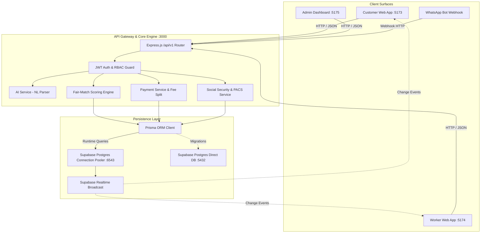

# SahakarSeva — System Architecture Document

---

## 1. High-Level Architecture Overview

---

## 2. Fair-Match Algorithm Mathematics

### Step 1: Candidate Pool Filter
$$\text{Pool} = \{ w \in \text{Workers} \mid w.\text{kyc} = \text{'verified'} \land w.\text{availability} = \text{'online'} \land \text{category} \in w.\text{skills} \land \text{Distance}(w, b) \le 5\text{km} \}$$

### Step 2: Normalized Feature Scoring
1. **Proximity Score ($S_{\text{prox}}$)**:
   $$S_{\text{prox}} = \max\left(0, 1 - \frac{d_{\text{km}}}{d_{\text{max}}}\right)$$
   Where $d_{\text{max}} = 5.0\text{km}$.

2. **Rating Score ($S_{\text{rate}}$)**:
   $$S_{\text{rate}} = \frac{\text{rating\_avg}}{5.0}$$

3. **Fairness Idle-Turn Score ($S_{\text{fair}}$)**:
   $$S_{\text{fair}} = \min\left(\frac{\text{idle\_hours}}{T_{\text{cap}}}, 1.0\right)$$
   Where $T_{\text{cap}} = 72.0\text{ hours}$.

### Step 3: Total Weighted Score
$$\text{Score}_{\text{total}} = (W_{\text{prox}} \times S_{\text{prox}}) + (W_{\text{rate}} \times S_{\text{rate}}) + (W_{\text{fair}} \times S_{\text{fair}})$$
Configurable Cooperative Society defaults:
$$W_{\text{prox}} = 0.40, \quad W_{\text{rate}} = 0.30, \quad W_{\text{fair}} = 0.30$$

---

## 3. Database Schema (11 Models)

1. `users` — Phone PK identifier, role enum, language preference.
2. `cooperatives` — Registration number, fee percentage (8.5%), algorithm weight overrides.
3. `worker_profiles` — Skills array, rating average, wallet balance, GPS coordinates, last job timestamp.
4. `customer_profiles` — Saved location coordinates.
5. `service_categories` — 8 standardized household categories.
6. `bookings` — Service request, coordinates, status state machine.
7. `match_offers` — Immutable audit record of scores and 90-second expiration.
8. `payments` — Fee breakdown, UPI transaction ID, success status.
9. `ratings` — 1-to-5 star feedback with recalculation hooks.
10. `disputes` — Escalations and admin resolution notes.
11. `social_security_links` & `profit_share_ledger` — e-Shram UANs and quarterly dividend records.
